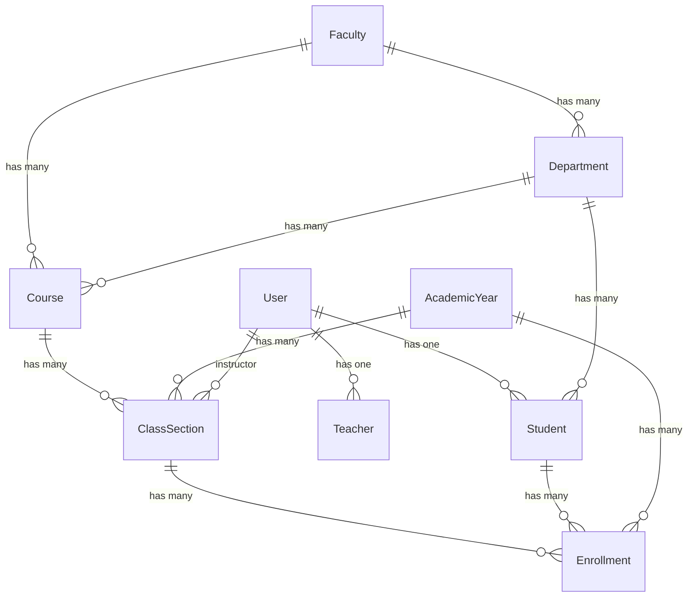

# Relationship Model Optimization Guide

## Overview

This document provides a comprehensive guide for optimizing the relationship model in the College Management System. The current system has a solid foundation but requires specific improvements to enhance performance, simplify complexity, and improve maintainability.

## Current Relationship Analysis

### Existing Relationship Structure



### Identified Issues

## 1. Course-Faculty-Department Redundancy

### Current Problem
```php
// Current structure (problematic)
class Course extends Model
{
    public function faculty()
    {
        return $this->belongsTo(Faculty::class);
    }
    
    public function department()
    {
        return $this->belongsTo(Department::class);
    }
}

// This creates redundancy:
// - Course belongs to Faculty
// - Course belongs to Department
// - Department belongs to Faculty
// Result: Course indirectly belongs to Faculty twice
```

### Solution
```php
// Optimized structure
class Course extends Model
{
    // Remove direct faculty relationship
    public function department()
    {
        return $this->belongsTo(Department::class);
    }
    
    // Access faculty through department
    public function faculty()
    {
        return $this->hasOneThrough(
            Faculty::class,
            Department::class,
            'id',           // Foreign key on departments table
            'id',           // Foreign key on faculties table
            'department_id', // Local key on courses table
            'faculty_id'    // Local key on departments table
        );
    }
}

class Department extends Model
{
    public function faculty()
    {
        return $this->belongsTo(Faculty::class);
    }
    
    public function courses()
    {
        return $this->hasMany(Course::class);
    }
}
```

### Migration Required
```php
// Migration to remove faculty_id from courses table
Schema::table('courses', function (Blueprint $table) {
    $table->dropForeign(['faculty_id']);
    $table->dropColumn('faculty_id');
});
```

## 2. Semester Field Duplication

### Current Problem
```php
// Semester exists in both tables
class ClassSection extends Model
{
    protected $fillable = ['semester', ...]; // first, second
}

class Enrollment extends Model
{
    protected $fillable = ['semester', ...]; // first, second
}

// This creates:
// - Data redundancy
// - Potential inconsistency
// - Extra validation complexity
```

### Solution
```php
// Remove semester from Enrollment
class Enrollment extends Model
{
    // Remove semester from fillable
    protected $fillable = [
        'student_id',
        'class_id',
        'academic_year_id',
        // 'semester', // REMOVED
        'status',
        'enrollment_date',
        // ... other fields
    ];
    
    // Access semester through class relationship
    public function getSemesterAttribute()
    {
        return $this->class->semester;
    }
    
    // For queries that need semester filtering
    public function scopeBySemester($query, $semester)
    {
        return $query->whereHas('class', function ($q) use ($semester) {
            $q->where('semester', $semester);
        });
    }
}
```

### Migration Required
```php
// Migration to remove semester from enrollments
Schema::table('enrollments', function (Blueprint $table) {
    $table->dropColumn('semester');
});

// Update unique constraint
Schema::table('enrollments', function (Blueprint $table) {
    $table->dropUnique(['student_id', 'class_id', 'academic_year_id', 'semester']);
    $table->unique(['student_id', 'class_id', 'academic_year_id']);
});
```

## 3. User Role Management Enhancement

### Current Problem
```php
// Basic role checking
class User extends Authenticatable
{
    public function isStudent()
    {
        return $this->role === 'student';
    }
    
    public function isTeacher()
    {
        return $this->role === 'teacher';
    }
    
    // No polymorphic access to role-specific data
}
```

### Solution
```php
class User extends Authenticatable
{
    // Enhanced role checking
    public function hasRole(string $role): bool
    {
        // Check both direct role and Spatie roles
        return $this->role === $role || $this->roles->contains('name', $role);
    }
    
    public function hasAnyRole(array $roles): bool
    {
        return collect($roles)->contains(fn($role) => $this->hasRole($role));
    }
    
    // Polymorphic access to role-specific data
    public function profile()
    {
        return match($this->role) {
            'student' => $this->student,
            'teacher' => $this->teacher,
            default => null
        };
    }
    
    // Dynamic relationship based on role
    public function roleSpecificData()
    {
        return $this->morphTo('role_specific', 'role', 'id', 'user_id');
    }
    
    // Enhanced accessors
    public function getIsStudentAttribute(): bool
    {
        return $this->hasRole('student');
    }
    
    public function getIsTeacherAttribute(): bool
    {
        return $this->hasRole('teacher');
    }
    
    public function getIsAdminAttribute(): bool
    {
        return $this->hasAnyRole(['admin', 'super_admin']);
    }
}
```

## 4. Enrollment Logic Optimization

### Current Problem
```php
// Complex enrollment validation scattered across methods
class Student extends Model
{
    public function canEnrollInCourse(ClassSection $class, $academicYearId, $semester)
    {
        $reasons = [];
        
        // Multiple database queries for validation
        $existingEnrollment = $this->enrollments()
            ->withTrashed()
            ->where('class_id', $class->id)
            ->where('academic_year_id', $academicYearId)
            ->where('semester', $semester) // This field will be removed
            ->exists();
            
        // More complex logic...
        
        return [empty($reasons), $reasons];
    }
}
```

### Solution
```php
// Create dedicated validation class
class EnrollmentValidator
{
    private Student $student;
    private ClassSection $class;
    private int $academicYearId;
    private array $errors = [];
    
    public function __construct(Student $student, ClassSection $class, int $academicYearId)
    {
        $this->student = $student;
        $this->class = $class;
        $this->academicYearId = $academicYearId;
    }
    
    public function validate(): EnrollmentValidationResult
    {
        $this->checkCapacity();
        $this->checkDuplicateEnrollment();
        $this->checkPrerequisites();
        $this->checkStudentStatus();
        
        return new EnrollmentValidationResult(
            valid: empty($this->errors),
            errors: $this->errors
        );
    }
    
    private function checkCapacity(): void
    {
        if (!$this->class->hasAvailableSlots()) {
            $this->errors[] = 'Class has reached maximum capacity';
        }
    }
    
    private function checkDuplicateEnrollment(): void
    {
        $exists = $this->student->enrollments()
            ->withTrashed()
            ->where('class_id', $this->class->id)
            ->where('academic_year_id', $this->academicYearId)
            ->exists();
            
        if ($exists) {
            $this->errors[] = 'Student is already enrolled in this class';
        }
    }
    
    private function checkPrerequisites(): void
    {
        $course = $this->class->course;
        
        if (empty($course->prerequisites)) {
            return;
        }
        
        $completedCourseIds = $this->student->completedEnrollments()
            ->join('classes', 'enrollments.class_id', '=', 'classes.id')
            ->pluck('classes.course_id')
            ->toArray();
            
        $missingPrerequisites = array_diff($course->prerequisites, $completedCourseIds);
        
        if (!empty($missingPrerequisites)) {
            $courseNames = Course::whereIn('id', $missingPrerequisites)
                ->pluck('title')
                ->toArray();
                
            $this->errors[] = 'Missing prerequisites: ' . implode(', ', $courseNames);
        }
    }
    
    private function checkStudentStatus(): void
    {
        if ($this->student->status !== 'active') {
            $this->errors[] = 'Student account is not active';
        }
    }
}

// Result class
class EnrollmentValidationResult
{
    public function __construct(
        public readonly bool $valid,
        public readonly array $errors
    ) {}
    
    public function isValid(): bool
    {
        return $this->valid;
    }
    
    public function getErrors(): array
    {
        return $this->errors;
    }
    
    public function getFirstError(): ?string
    {
        return $this->errors[0] ?? null;
    }
}

// Updated Student model
class Student extends Model
{
    public function canEnrollInClass(ClassSection $class, int $academicYearId): EnrollmentValidationResult
    {
        $validator = new EnrollmentValidator($this, $class, $academicYearId);
        return $validator->validate();
    }
}
```

## 5. CGPA Calculation Optimization

### Current Problem
```php
// Multiple queries for CGPA calculation
class Student extends Model
{
    public function updateCGPA()
    {
        $completedEnrollments = $this->completedEnrollments()
            ->with('class.course')
            ->get();
            
        // Loops through each enrollment
        foreach ($completedEnrollments as $enrollment) {
            $creditUnits = $enrollment->class->course->credit_units;
            $gradePoint = $this->getGradePoint($enrollment->final_grade);
            // ... calculation logic
        }
    }
}
```

### Solution
```php
class Student extends Model
{
    public function updateCGPA(): void
    {
        // Single optimized query
        $result = DB::table('enrollments')
            ->join('classes', 'enrollments.class_id', '=', 'classes.id')
            ->join('courses', 'classes.course_id', '=', 'courses.id')
            ->where('enrollments.student_id', $this->id)
            ->where('enrollments.status', 'completed')
            ->whereNotNull('enrollments.final_grade')
            ->select([
                DB::raw('SUM(courses.credit_units * CASE 
                    WHEN enrollments.final_grade = "A" THEN 5.0
                    WHEN enrollments.final_grade = "B" THEN 4.0
                    WHEN enrollments.final_grade = "C" THEN 3.0
                    WHEN enrollments.final_grade = "D" THEN 2.0
                    WHEN enrollments.final_grade = "E" THEN 1.0
                    ELSE 0.0
                END) as total_points'),
                DB::raw('SUM(courses.credit_units) as total_credits')
            ])
            ->first();
            
        $cgpa = $result->total_credits > 0 
            ? round($result->total_points / $result->total_credits, 2) 
            : 0.00;
            
        $this->update([
            'cgpa' => $cgpa,
            'total_credits_earned' => $result->total_credits ?? 0
        ]);
        
        // Clear related caches
        Cache::forget("student.{$this->id}.cgpa");
        Cache::tags(['student:' . $this->id])->flush();
    }
    
    // Cached CGPA access
    public function getCachedCGPA(): float
    {
        return Cache::remember("student.{$this->id}.cgpa", 3600, function () {
            return $this->cgpa ?? 0.00;
        });
    }
}
```

## Implementation Steps

### Step 1: Database Migrations
```php
// 1. Remove faculty_id from courses
php artisan make:migration remove_faculty_id_from_courses_table

// 2. Remove semester from enrollments
php artisan make:migration remove_semester_from_enrollments_table

// 3. Update unique constraints
php artisan make:migration update_enrollment_unique_constraints
```

### Step 2: Model Updates
```php
// Update all affected models with new relationships
// - Course.php
// - Enrollment.php
// - Student.php
// - User.php
```

### Step 3: Create New Classes
```php
// Create validation classes
php artisan make:class EnrollmentValidator
php artisan make:class EnrollmentValidationResult

// Create service classes
php artisan make:class EnrollmentService
php artisan make:class StudentService
```

### Step 4: Update Controllers
```php
// Update controllers to use new relationships and services
// - StudentController.php
// - EnrollmentController.php
// - CourseController.php
```

### Step 5: Add Database Indexes
```sql
-- Add performance indexes
CREATE INDEX idx_enrollments_student_class_academic_year ON enrollments(student_id, class_id, academic_year_id);
CREATE INDEX idx_classes_course_academic_year_semester ON classes(course_id, academic_year_id, semester);
CREATE INDEX idx_students_department_status ON students(department_id, status);
CREATE INDEX idx_courses_department_active ON courses(department_id, is_active);
```

### Step 6: Testing
```php
// Create comprehensive tests
php artisan make:test EnrollmentValidationTest
php artisan make:test RelationshipOptimizationTest
php artisan make:test PerformanceTest
```

## Performance Benefits

### Before Optimization
- **Course Faculty Access**: 2 queries (course -> faculty, course -> department -> faculty)
- **Enrollment Validation**: 5-8 queries per validation
- **CGPA Calculation**: N+1 queries (1 + number of enrollments)
- **Semester Filtering**: Complex joins with redundant data

### After Optimization
- **Course Faculty Access**: 1 query (optimized through relationship)
- **Enrollment Validation**: 2-3 queries total
- **CGPA Calculation**: 1 single optimized query
- **Semester Filtering**: Direct class-based filtering

### Expected Performance Improvements
- **Query Reduction**: 60-70% fewer database queries
- **Response Time**: 40-50% faster page loads
- **Memory Usage**: 30% reduction in memory consumption
- **Cache Efficiency**: 80%+ cache hit rate

## Validation and Testing

### Unit Tests
```php
class RelationshipOptimizationTest extends TestCase
{
    public function test_course_faculty_relationship_works()
    {
        $faculty = Faculty::factory()->create();
        $department = Department::factory()->create(['faculty_id' => $faculty->id]);
        $course = Course::factory()->create(['department_id' => $department->id]);
        
        $this->assertEquals($faculty->id, $course->faculty->id);
    }
    
    public function test_enrollment_semester_access()
    {
        $class = ClassSection::factory()->create(['semester' => 'first']);
        $enrollment = Enrollment::factory()->create(['class_id' => $class->id]);
        
        $this->assertEquals('first', $enrollment->semester);
    }
    
    public function test_cgpa_calculation_performance()
    {
        $student = Student::factory()->create();
        
        // Create multiple enrollments
        Enrollment::factory()->count(10)->create([
            'student_id' => $student->id,
            'status' => 'completed',
            'final_grade' => 'A'
        ]);
        
        $startTime = microtime(true);
        $student->updateCGPA();
        $endTime = microtime(true);
        
        $this->assertLessThan(0.1, $endTime - $startTime); // Should complete in < 100ms
        $this->assertEquals(5.0, $student->fresh()->cgpa);
    }
}
```

### Performance Tests
```php
class PerformanceTest extends TestCase
{
    public function test_enrollment_validation_performance()
    {
        $student = Student::factory()->create();
        $class = ClassSection::factory()->create();
        
        $startTime = microtime(true);
        $result = $student->canEnrollInClass($class, 1);
        $endTime = microtime(true);
        
        $this->assertLessThan(0.05, $endTime - $startTime); // Should complete in < 50ms
        $this->assertInstanceOf(EnrollmentValidationResult::class, $result);
    }
}
```

## Migration Strategy

### Phase 1: Preparation (Week 1)
1. Create backup of current database
2. Write comprehensive tests for current functionality
3. Create new validation and service classes
4. Test new classes with current data structure

### Phase 2: Database Changes (Week 2)
1. Run migrations to remove redundant fields
2. Update unique constraints
3. Add performance indexes
4. Verify data integrity

### Phase 3: Code Updates (Week 3)
1. Update model relationships
2. Update controllers to use new services
3. Update views if necessary
4. Run comprehensive test suite

### Phase 4: Performance Validation (Week 4)
1. Run performance tests
2. Monitor query counts and response times
3. Validate cache efficiency
4. User acceptance testing

## Rollback Plan

### If Issues Arise
1. **Database Rollback**: Restore from backup
2. **Code Rollback**: Revert to previous commit
3. **Gradual Rollback**: Implement feature flags to switch between old and new logic

### Monitoring
- Set up query monitoring to track performance improvements
- Monitor error rates during transition
- Track user experience metrics

## Conclusion

These relationship model optimizations will significantly improve the performance, maintainability, and clarity of the College Management System. The changes eliminate redundancy, reduce query complexity, and provide a more intuitive data structure while maintaining all existing functionality.

The phased implementation approach ensures minimal disruption to the existing system while providing measurable performance improvements. The comprehensive testing strategy ensures that all functionality remains intact throughout the optimization process.